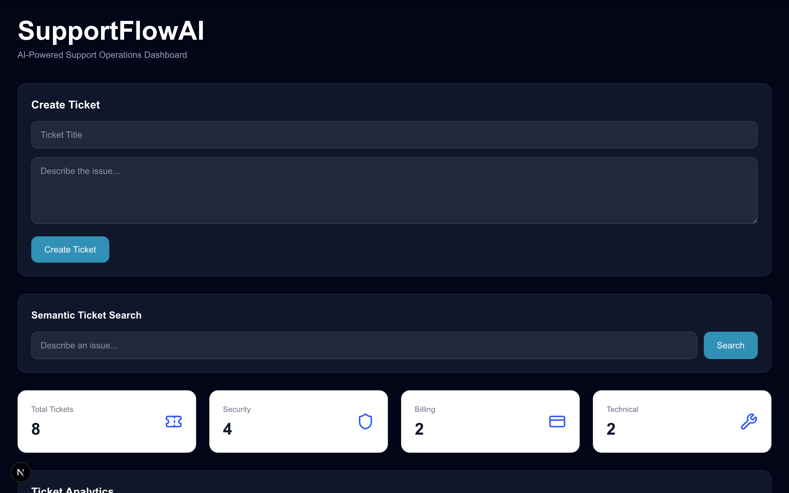
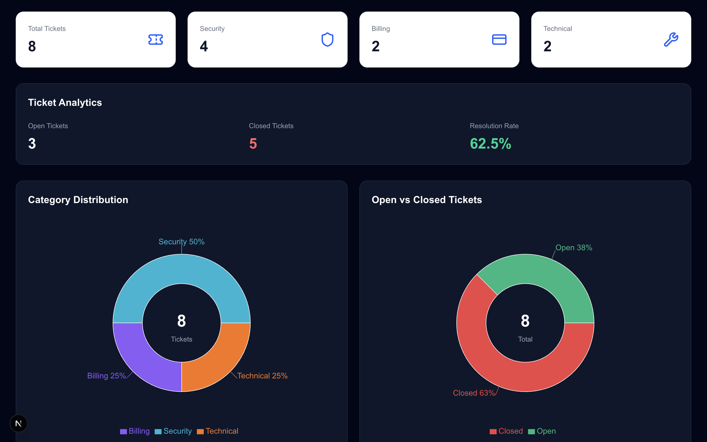
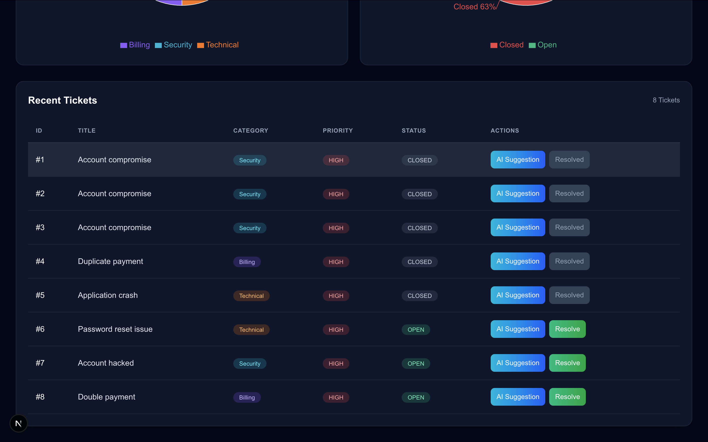
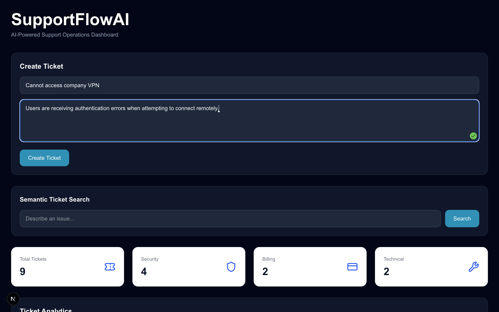
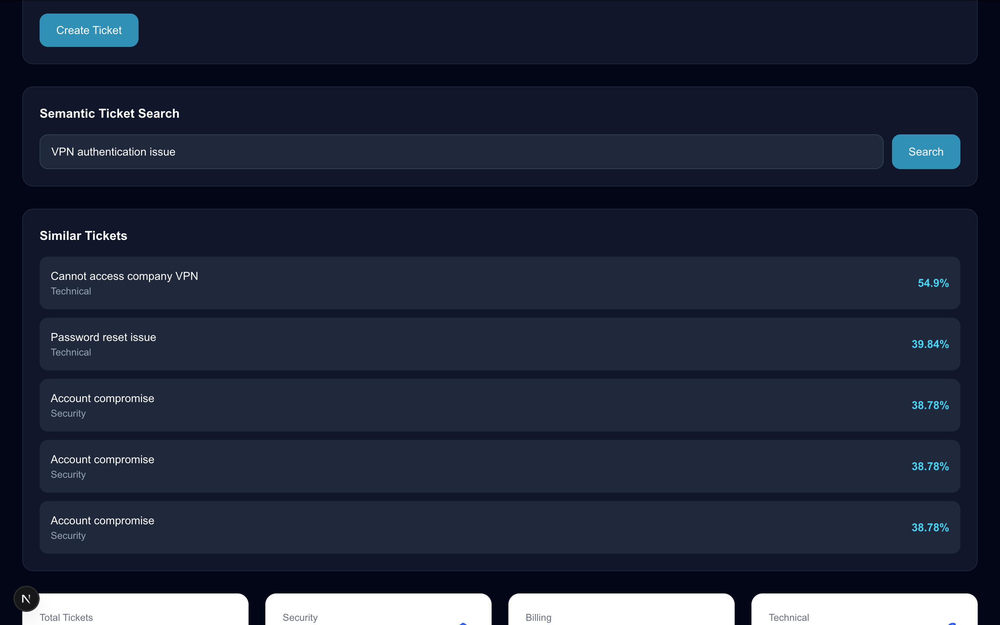
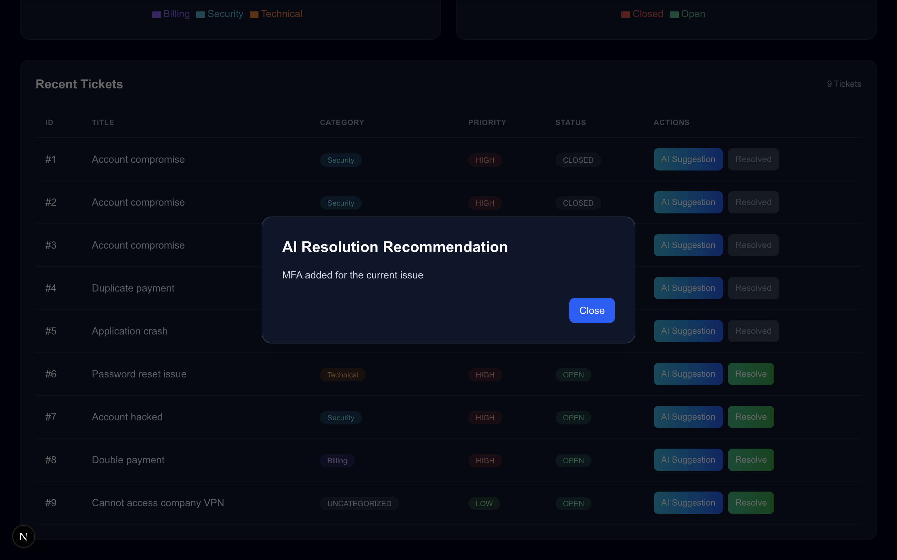
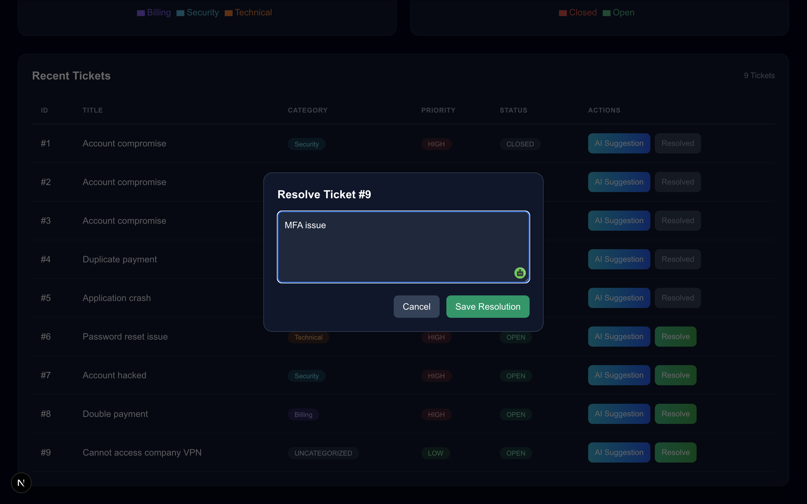
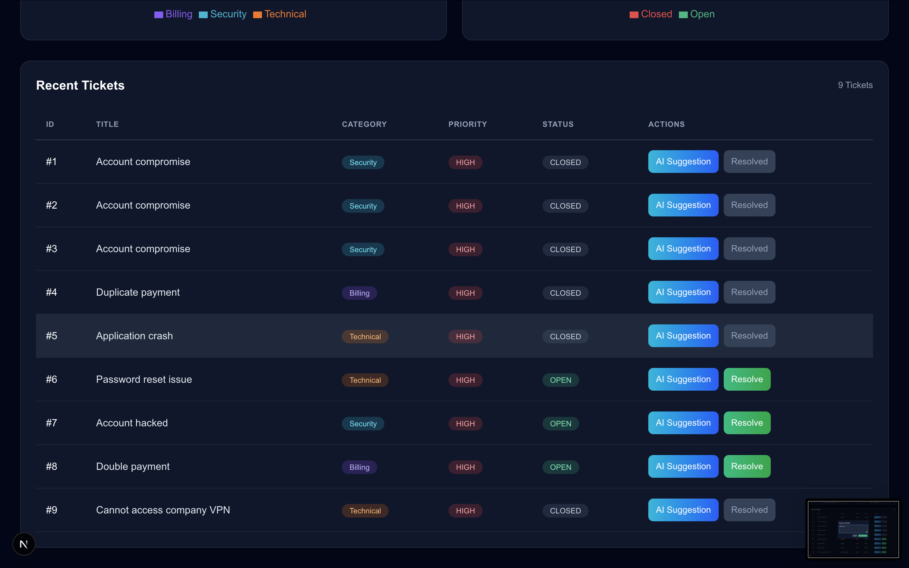

# SupportFlowAI

AI-powered support ticket management platform that combines ticket creation, semantic search, analytics, AI-assisted resolution recommendations, and ticket lifecycle management in a modern dashboard.

## Overview

SupportFlowAI helps support teams manage and resolve tickets more efficiently by combining traditional ticket management workflows with AI-powered assistance and analytics.

The platform allows users to:

* Create and manage support tickets
* Search similar historical tickets using semantic similarity
* View AI-generated resolution recommendations
* Track ticket resolution workflows
* Monitor support operations through analytics dashboards
* Visualize ticket trends and category distributions

---

## Features

### Ticket Management

* Create new support tickets
* View all tickets in a centralized dashboard
* Track ticket status (Open / Closed)
* Assign ticket categories automatically
* Maintain ticket history

### AI Resolution Recommendations

Generate AI-assisted recommendations for resolving support tickets.

Examples:

* MFA configuration guidance
* Password reset recommendations
* VPN troubleshooting suggestions
* Account recovery procedures

### Ticket Resolution Workflow

* Open resolution modal
* Enter resolution notes
* Save ticket resolutions
* Automatically update ticket status
* Track resolution metrics

### Semantic Ticket Search

Search historical tickets using natural language.

Example Query:

> VPN authentication issue

Returns:

* Cannot access company VPN
* Password reset issue
* Account compromise

with similarity scores for each result.

### Analytics Dashboard

Monitor support operations using:

* Total Tickets
* Open Tickets
* Closed Tickets
* Resolution Rate

### Data Visualization

Interactive analytics powered by Recharts:

#### Category Distribution

* Security Tickets
* Billing Tickets
* Technical Tickets

#### Open vs Closed Analysis

* Open ticket percentage
* Closed ticket percentage
* Resolution performance metrics

---

## Technology Stack

### Frontend

* Next.js 15
* React
* TypeScript
* Tailwind CSS
* Recharts

### Backend

* FastAPI
* Python

### Database

* PostgreSQL
* pgvector

### AI & Search

* OpenAI Embeddings
* Vector Similarity Search
* Semantic Ticket Retrieval

### Infrastructure

* Docker
* Redis
* Celery

---

## Demo Workflow

### 1. Dashboard Overview

The application launches with a centralized support operations dashboard displaying:

* Total Tickets
* Security Tickets
* Billing Tickets
* Technical Tickets
* Resolution Rate
* Open vs Closed Ticket Metrics

**Outcome:** Provides an instant overview of support performance and workload.

---

### 2. Create a New Support Ticket

Navigate to the **Create Ticket** section and enter:

**Title:**
Cannot access company VPN

**Description:**
Users are receiving authentication errors when attempting to connect remotely.

Click **Create Ticket**.

**Result:**

* Ticket is added to the system
* Total ticket count increases automatically
* Dashboard statistics refresh in real time
* Ticket appears in the Recent Tickets table

---

### 3. Semantic Ticket Search

Navigate to **Semantic Ticket Search** and enter:

**Search Query:**
VPN authentication issue

Click **Search**.

**Result:**

* System performs semantic similarity matching
* Related historical tickets are returned
* Similarity scores are displayed
* Previously resolved incidents can be identified quickly

---

### 4. AI Resolution Recommendation

From the Recent Tickets table, select a ticket and click:

**AI Suggestion**

**Result:**

* AI-generated resolution recommendation appears in a modal window
* Suggested remediation steps are presented instantly
* Support agents can use recommendations to accelerate troubleshooting

---

### 5. Resolve an Open Ticket

Select an open ticket and click:

**Resolve**

Enter the resolution:

**Resolution:**
MFA issue resolved by enabling multi-factor authentication and updating user credentials.

Click **Save Resolution**.

**Result:**

* Ticket status changes from OPEN to CLOSED
* Ticket is moved to the resolved state
* Resolution information is stored
* Analytics update automatically

---

### 6. Ticket Analytics Dashboard

Review the analytics section to monitor support operations:

**Available Visualizations**

* Category Distribution Chart
* Open vs Closed Ticket Chart
* Total Ticket Metrics
* Resolution Rate
* Category-Based Ticket Breakdown

**Result:**

* Real-time visibility into support trends
* Faster identification of recurring issues
* Improved operational decision-making through analytics

---

## Project Structure

frontend/
├── app/
├── components/
│ ├── CreateTicketForm.tsx
│ ├── TicketCharts.tsx
│ ├── TicketTable.tsx
│ ├── RecommendationModal.tsx
│ └── StatCard.tsx
├── public/
└── types/

backend/
├── main.py
├── ticket.py
├── worker.py
├── tasks.py
└── Dockerfile

---

## Future Improvements

* User authentication and role-based access
* Multi-agent AI support workflows
* SLA monitoring
* Real-time notifications
* Ticket assignment system
* Advanced reporting
* Knowledge base integration
* Multi-tenant architecture

---

## Author

Dhairya Mehta

MS Software Engineering
Arizona State University

Focused on building AI-powered software systems that improve operational efficiency, automation, and support workflows.

## Screenshots

### Dashboard Overview

### Ticket Analytics

### Ticket Management

### Create Ticket Workflow

### Semantic Ticket Search

### AI Resolution Recommendation

### Ticket Resolution Modal

### Resolved Ticket Status
